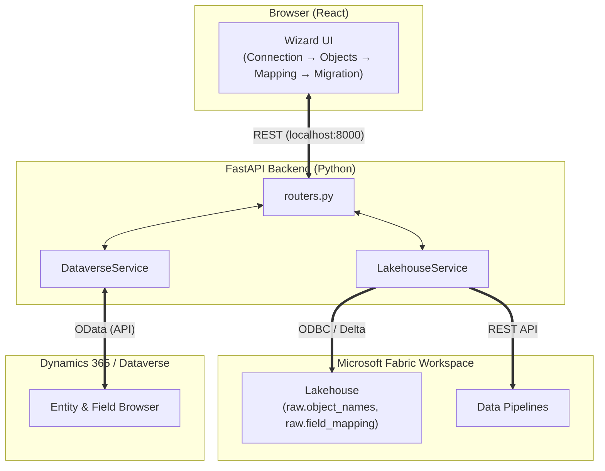

# SF2Dynamics

> **Salesforce → Microsoft Dynamics 365 Migration Wizard**
> A full-stack tool that guides users through connecting, selecting, mapping, and migrating Salesforce data into Dynamics 365 via a Microsoft Fabric Lakehouse.

[](frontend)
[](backend)
[](#)
[](#)

---

## Features

- **4-Step Wizard UI** — Seamlessly navigate from Connection → Objects → Field Mapping → Migration.
- **Live Dataverse Browsing** — Search and select target entities and fields directly from your Dynamics 365 environment in real time.
- **Bulk Field Mapping Sync** — Confirm all mappings locally, then push to the Fabric Lakehouse in a single, efficient Delta write.
- **Object Selection Sync** — Toggle Salesforce objects intuitively with a "Sync Now" button (one Fabric write per sync).
- **Pipeline Monitoring** — View real-time activity timelines with status polling every 2 seconds.
- **Session Persistence** — Your active tab, confirmed steps, and selected objects securely survive page refreshes.
- **Responsive Design** — Fully optimized for mobile and tablet devices with a sleek slide-in sidebar navigation.
- **Dark Mode** — Automatically adapts to your system preferences via `prefers-color-scheme`.

---

## Architecture



**Data Flow Overview:**
1. Salesforce object and field metadata is pre-loaded into `raw.object_names`, `raw.object_mapping`, and `raw.field_mapping` tables in the Fabric Lakehouse.
2. The UI reads this data, allowing users to adjust mappings, and writes confirmed mappings back in a single bulk Delta operation.
3. The Fabric Data Pipeline is triggered via REST and monitored by polling `/migration/status/{job_id}`.

---

## Project Structure

```text
SF2Dynamics/
├── backend/
│   ├── app/
│   │   ├── main.py                    # FastAPI entry point
│   │   ├── routers.py                 # All API routes
│   │   └── services/
│   │       ├── lakehouse_service.py   # Fabric SQL + OneLake + Pipeline Integration
│   │       ├── dataverse_service.py   # Dynamics 365 / Dataverse API Integration
│   │       ├── connection_service.py  # Local Credential Store
│   │       ├── migrate_flags_service.py
│   │       ├── connector_test_service.py
│   │       └── run_history_service.py
│   ├── configs.json        # Saved connection profiles (local, gitignored)
│   ├── migrate_flags.json  # Object selection state
│   ├── run_history.json    # Pipeline run log
│   └── requirements.txt
└── frontend/
    └── src/
        ├── App.js                      # Application Shell, wizard state, localStorage
        ├── App.css                     # Design system & responsive layout styles
        └── components/
            ├── ConnectionTab.js        # Step 1 — Manage connections
            ├── ObjectsTab.js           # Step 2 — Select objects + Sync
            ├── MappingTab.js           # Step 3 — Field mapping + Sync
            └── MigrationTab.js         # Step 4 — Run & monitor pipeline
```

---

## Prerequisites

| Requirement | Version | Details |
|---|---|---|
| **Python** | 3.11+ | Backend runtime |
| **Node.js** | 18+ | Frontend runtime |
| **ODBC Driver 18** | Latest | Required for SQL Server connectivity |
| **Microsoft Fabric** | N/A | Workspace with Lakehouse + Pipeline |
| **Dynamics 365** | N/A | Environment with a service principal |

**Required Fabric Lakehouse Tables:**

| Table | Purpose |
|---|---|
| `raw.object_names` | List of Salesforce objects + migration flags |
| `raw.object_mapping` | Salesforce object → Dynamics 365 entity mapping |
| `raw.field_mapping` | Salesforce field → Dynamics 365 field mapping |

---

## Getting Started

### 1. Backend Setup

```bash
cd backend
python -m venv venv

# Activate Virtual Environment
venv\Scripts\activate          # Windows
# source venv/bin/activate     # macOS / Linux

# Install Dependencies
pip install -r requirements.txt

# Run the Server
uvicorn app.main:app --reload --host 0.0.0.0 --port 8000
```

- **API Base URL:** `http://localhost:8000`
- **Interactive Swagger Docs:** `http://localhost:8000/docs`

### 2. Frontend Setup

```bash
cd frontend

# Install Dependencies
npm install

# Start the Development Server
npm start
```

- **Application UI:** `http://localhost:3000`

---

## Step-by-Step Workflow

### **Step 1 — Connections**
Add credentials for each required service. A **Fabric Lakehouse** connection is required; **Dynamics 365** must be added before running the pipeline. Built-in connection testing is available.

| Connector | Required Credentials |
|---|---|
| Fabric Lakehouse | Tenant ID, SQL Endpoint, Database, Client ID/Secret, Workspace ID, Pipeline ID |
| Dynamics 365 / Azure | Tenant ID, Client ID/Secret, Dataverse URL |
| Salesforce | Instance URL, Consumer Key/Secret |
| SharePoint | Site Hostname, Site Path |

### **Step 2 — Salesforce Objects**
Objects are dynamically read from `raw.object_names`. Toggle the objects you want to include, then click **Sync Now** to push the selection securely to Fabric in a single call.

### **Step 3 — Field Mapping**
Suggestions are automatically pre-loaded from `raw.object_mapping` and `raw.field_mapping`. For each object:
- Choose the target Dynamics 365 entity from a real-time Dataverse search.
- Adjust field-to-field mappings.
- Custom objects (`__c`) can seamlessly map to existing or new custom tables.

*Confirm each object with the toggle, then click **Sync Now once** — all confirmed mappings are merged and written to both Delta tables in a single bulk operation.*

### **Step 4 — Migration**
This step triggers the Fabric Data Pipeline. The UI features a live activity timeline that updates every 2 seconds. In-flight runs can be cancelled directly from the UI, and all execution data is safely logged in the **Run History**.

---

## Key API Endpoints

| Method | Path | Description |
|---|---|---|
| `POST` | `/config` | Save a connection profile |
| `GET` | `/config` | Retrieve a connection profile by name |
| `DELETE` | `/config` | Delete a connection profile by name |
| `POST` | `/config/test-named` | Test a saved connection by name |
| `GET` | `/objects` | List SF objects from Lakehouse |
| `POST` | `/objects/confirm` | Push object selections to Fabric (one write) |
| `GET` | `/field-suggestions/{object}` | Load mapping suggestions for an object |
| `POST` | `/mapping/bulk` | Push all confirmed mappings in one Delta write |
| `GET` | `/dataverse/entities` | Browse Dataverse entities |
| `GET` | `/dataverse/entities/{name}/fields` | Browse entity fields |
| `POST` | `/migration/start` | Trigger the Fabric pipeline |
| `GET` | `/migration/status/{job_id}` | Poll pipeline run status |
| `POST` | `/migration/cancel/{job_id}` | Cancel a running pipeline |
| `GET` | `/migration/history` | Retrieve run history |

---

## Deployment

### Local (Development)
Run both backend and frontend environments concurrently as described in the [Getting Started](#-getting-started) section. Both services are required for the wizard to function.

### Production Considerations
- Serve the compiled React build (`npm run build`) behind a reliable static file server or CDN (e.g., Nginx, Vercel, Netlify).
- Run the FastAPI backend using a production-grade ASGI server:
  ```bash
  uvicorn app.main:app --host 0.0.0.0 --port 8000 --workers 4
  ```
- **Environment Variables:** Set `REACT_APP_API_URL` (or update your `fetch` base URL) to point to your live backend.
- **Security:** Manage credentials using a robust secrets manager (e.g., Azure Key Vault) rather than storing them in the `configs.json`.
- **CORS:** Ensure CORS headers in `main.py` rigidly allow only your registered frontend origins.

---

## Important Notes

- **Credential Storage:** `backend/configs.json` stores credentials locally during development. **Do not commit this file to version control.**
- **Performance:** Field mapping synchronization uses a **single bulk Delta write**—meaning all confirmed objects are merged into existing tables in a unified, performant operation rather than via individual requests.
- **Time Zones:** Time stamps retrieved from the Fabric API are automatically normalized to UTC before display, guaranteeing that pipeline run metrics reflect correctly against your local system clock.
- **State Resilience:** The active wizard tab, step confirmations, and selected object lists are durably saved to `localStorage`, allowing uninterrupted workflow resumes upon accidental page navigation or refreshing.
